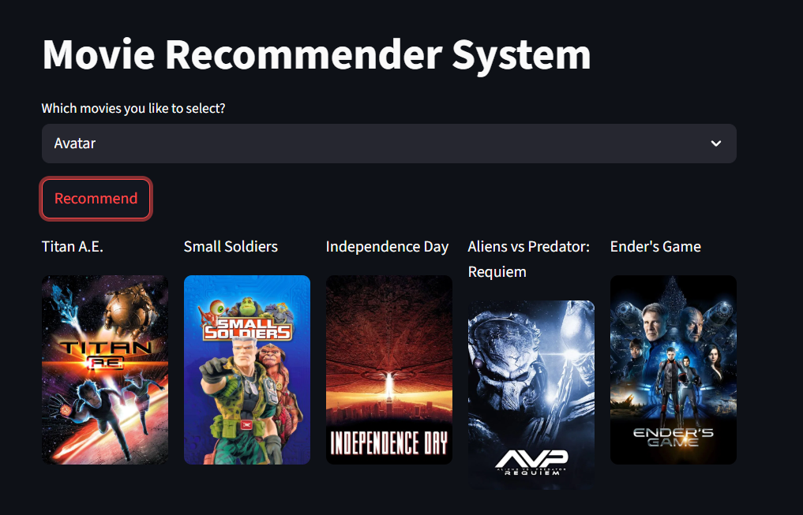

# 🎬 Movie Recommendation System

Welcome to my **AI-powered Movie Recommendation System** built with **Streamlit**!  
Just enter your favorite movie, and the system will suggest similar titles instantly.



---

## 🚀 What it Does

🔍 **Find Similar Movies**  
You input a movie you love.  
📊 It uses **cosine similarity** to find movies with similar features.  
🎯 Returns **top 5 recommendations** instantly.

---

## 🛠️ Tech Stack

- Python
- Pandas, Scikit-learn
- Streamlit
- Cosine Similarity

---

## 🧪 Run it Locally

```bash
# Clone the repo
git clone https://github.com/your-username/movie-recommender.git
cd movie-recommender

# Set up virtual environment
python -m venv venv
venv\Scripts\activate  # For Windows

# Install dependencies
pip install -r requirements.txt

# Run the app
streamlit run recommender.py
